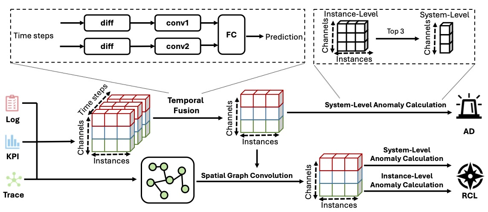

# DeST

## Quick Started
### Environment
Python 3.9.13, PyTorch 1.12.1, scikit-learn 1.1.2, and DGL 0.9.0 are suggested.


### Dataset: 
Dataset D1 is collected from a simulated e-commerce microservice system, which is deployed in a real cloud environment with traffic consistent with real business flow. The system comprises 46 instances, including 40 microservice instances and 6 virtual machines. Failure records were collected by replaying the failures over several days in May 2022. The failure scenarios are derived from actual failures (Container Hardware, Container Network, Node CPU, Node Disk, and Node Memory-related failures). The collected records were labeled with their respective root cause instances and failure types. The raw data and labels of D1 are publicly available at https://anonymous.4open.science/r/Aiops-Dataset-1E0E.

Dataset D2 is collected from the management system of a top-tier commercial bank, which comprises 18 instances, including microservices, servers, databases, and dockers. Two experienced operators examined the failure records from January 2021 to June 2021 and labeled the root cause instances and failure types (Memory, CPU, Network, Disk, JVM-Memory, and JVM-CPU-related failures). Each operator conducted the labeling process separately and cross-checked the labels to ensure consensus. D2 has been used in the International AIops Challenge 2021 https://aiops-challenge.com.

We have preprocessed two raw datasets and placed them in the following folder.

D1: ART/data/D1

D2: ART/data/D2

In the folder:

- `cases` : There are two files in this directory.

  - `ad_cases.pkl`: The list of failure timestamps.

  - `cases.csv`: The four items in the table header indicate the failure injection time, failure level, root cause of the failure, and failure type respectively.

- `hash_info` : There are four files in this directory. They all hold a dictionary that records the correspondence between names and indexes.

- `samples` : There are three files in this directory, all samples (`samples.pkl`), samples for pre-training (`train_samples.pkl`), and samples for evaluation (`test_samples.pkl`).

Each sample is a tuple: (timestamp, graphs, features of each node). Graphs indicate the topology of the microservice system generated from call relationships and deployment information; Features of each node are composed of pod metric feats, pod trace feats, pod log feats and node metric feats.

### Demo

We provide a demo. Before running the following commands, please unzip D1.zip and D2.zip.

```python
python main.py
```

## Overview


## Hyperparameter Settings


# 🎉 Acknowledgement
We appreciate the following github repos a lot for their valuable code base:

https://github.com/bbyldebb/ART

https://github.com/dawnvince/EasyTSAD
