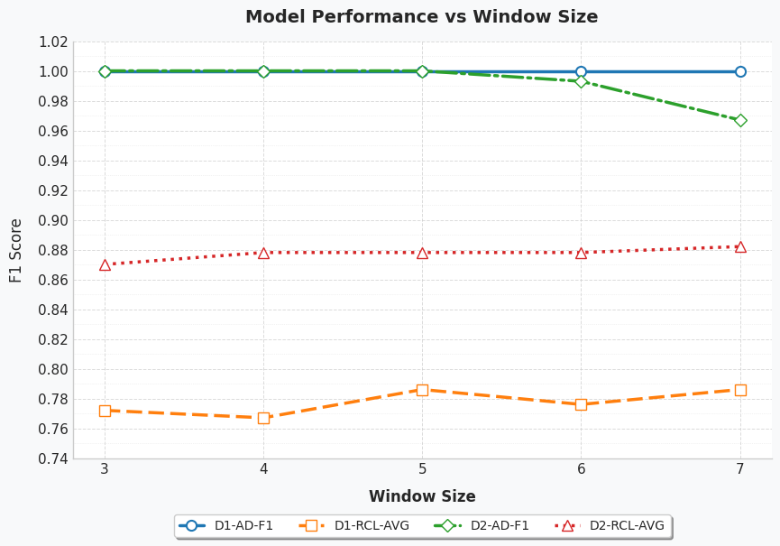
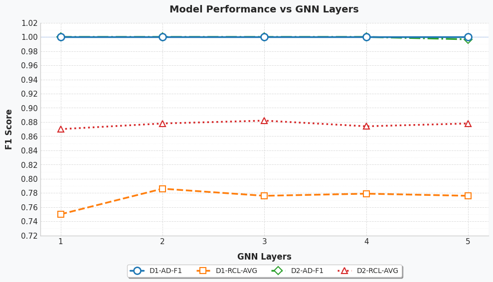
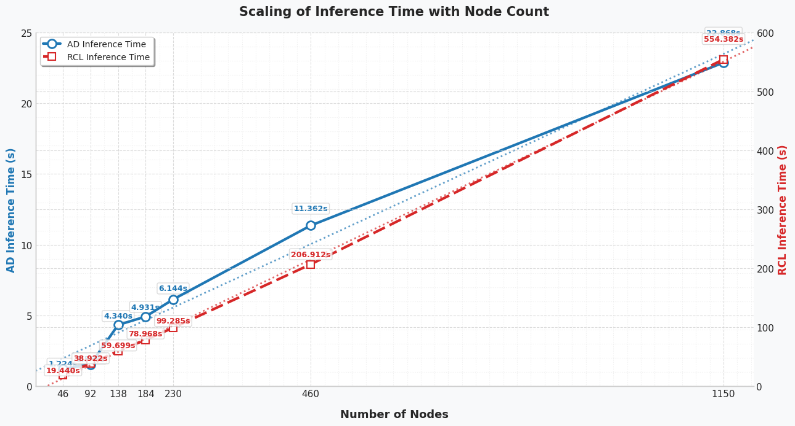

# DeST

## Quick Started
### Environment
Python 3.9.13, PyTorch 1.12.1, scikit-learn 1.1.2, and DGL 0.9.0 are suggested.


### Dataset: 
Dataset D1 is collected from a simulated e-commerce microservice system, which is deployed in a real cloud environment with traffic consistent with real business flow. The system comprises 46 instances, including 40 microservice instances and 6 virtual machines. Failure records were collected by replaying the failures over several days in May 2022. The failure scenarios are derived from actual failures (Container Hardware, Container Network, Node CPU, Node Disk, and Node Memory-related failures). The collected records were labeled with their respective root cause instances and failure types. The raw data and labels of D1 are publicly available at https://anonymous.4open.science/r/Aiops-Dataset-1E0E.

Dataset D2 is collected from the management system of a top-tier commercial bank, which comprises 18 instances, including microservices, servers, databases, and dockers. Two experienced operators examined the failure records from January 2021 to June 2021 and labeled the root cause instances and failure types (Memory, CPU, Network, Disk, JVM-Memory, and JVM-CPU-related failures). Each operator conducted the labeling process separately and cross-checked the labels to ensure consensus. D2 has been used in the International AIops Challenge 2021 https://aiops-challenge.com.

We have preprocessed two raw datasets and placed them in the following folder.

D1: ART/data/D1

D2: ART/data/D2

In the folder:

- `cases` : There are two files in this directory.

  - `ad_cases.pkl`: The list of failure timestamps.

  - `cases.csv`: The four items in the table header indicate the failure injection time, failure level, root cause of the failure, and failure type respectively.

- `hash_info` : There are four files in this directory. They all hold a dictionary that records the correspondence between names and indexes.

- `samples` : There are three files in this directory, all samples (`samples.pkl`), samples for pre-training (`train_samples.pkl`), and samples for evaluation (`test_samples.pkl`).

Each sample is a tuple: (timestamp, graphs, features of each node). Graphs indicate the topology of the microservice system generated from call relationships and deployment information; Features of each node are composed of pod metric feats, pod trace feats, pod log feats and node metric feats.

### Demo

We provide a demo. Before running the following commands, please unzip D1.zip and D2.zip.

```python
python main.py
```

## Overview


## Hyperparameter Settings
To verify the robustness of our algorithm against hyperparameters, we systematically optimized two critical parameters through combinatorial search: GNN layers (tested range: 1-5) and window sizes (tested range: 3-7). A clear tradeoff in window sizing: Excessively small windows (e.g., size=3) fail to capture complete failure contexts, while overly large windows (e.g., size=7) introduce irrelevant noise.  Based on joint optimization of F1 and AVG@K metrics, we recommend GNN layers=2 and window size=5 as the optimal configuration, balancing information completeness and noise suppression.



### Other Parameter Description in the Demo

Take dataset D1 as an example.

#### Pre-training in SSL

- **instance_dim** : The number of microservice instances. (default: 46)
- **channel_dim** : The number of data channels. (default: 130)
- **gnn_hidden_dim** : The hidden dimension of GAT. (default: 64)
- **gnn_out_dim** : The output dimension of GAT. (default: 32)
- **noise_rate** : Dropout ratio. (default: 0.3)
- **gnn_layers** : The number of layers of GAT. (default: 2)
- **epochs** : The training epochs. (default: 1000)
- **batch_size** : The batch size. (default: 4)
- **learning_rate** : The learning rate. (default: 0.001)

#### Downstream tasks.

- **split_ratio** : The ratio for splitting the initialization set and the test set. (default: 0.6)
- **method & t_value** : The methods and parameters for aggregating ILD to obtain SLD. The method can be either 'num' or 'prob', representing the specified number and probability methods, respectively. 'num' can take 't_value' in the range [1, instance_dim], while 'prob' can take 't_value' in the range [0,1). (default: 'num', 3)
- **q & level** : The initialize parameters for SPOT. (default: 0.1, 0.95)
- **delay** : Consider anomalies with intervals smaller than the delay as the same failure. (default: 600)
- **impact_window** : The impact range of a single failure. Functions similarly to 'before' and 'after'. (default: 300)
- **before & after** : The failure injection time is inject_ts. Assuming the failure impact range is [inject_ts-before, inject_ts+after], take the data within this time window for analysis. (default: 59, 300)
- **max_clusters** : The maximum number of clusters obtained from the cut tree in failure triage. (default: 25)
- **verbose** : Control the output to be either concise or verbose. (default: False)

More details can be found in the configuration file: ART/config/D1.yaml.

## Large-Scale Node Experiment
We conducted additional large-scale experiments with datasets of thousands of nodes and billions of records, testing the efficiency of our anomaly detection and root cause localization methods at scale. These results  demonstrate the scalability and robustness of our approach on larger deployments.




# 🎉 Acknowledgement
We appreciate the following github repos a lot for their valuable code base:

https://github.com/bbyldebb/ART

https://github.com/dawnvince/EasyTSAD
